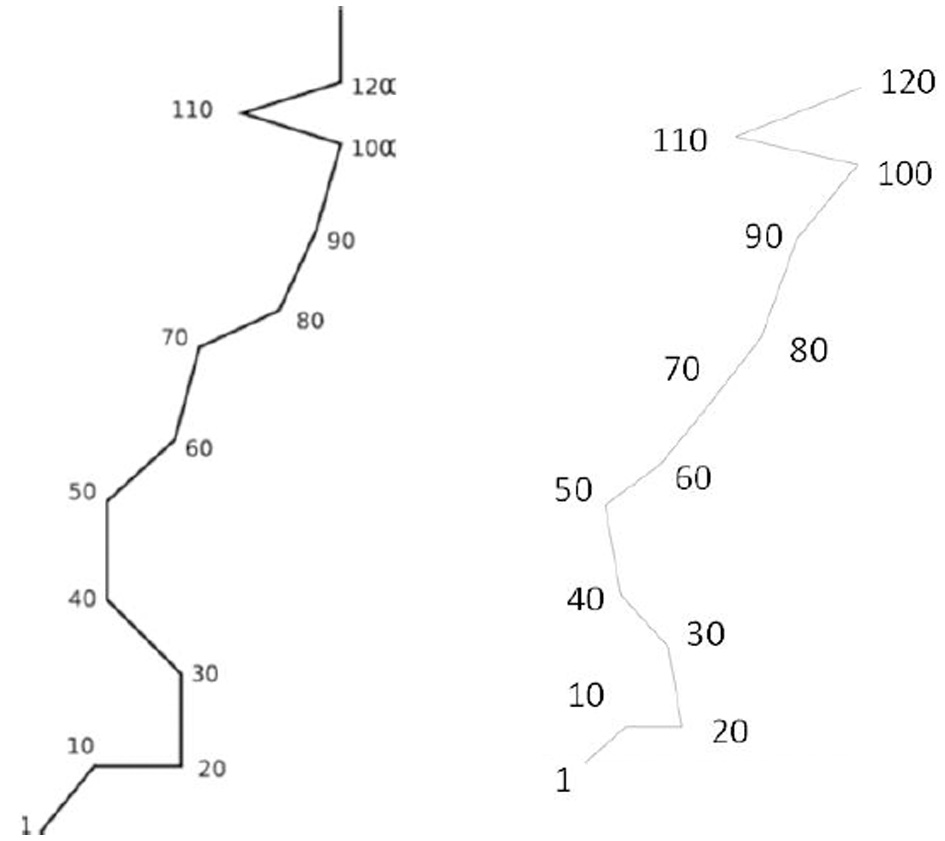

+++
id = "POR-0016"
title = "AB: numbers, calendars, equations, and ages inhabit a superimposed mental room"
account_type = "journal-case"
subject = "AB"
source_title = "An extended case study on the phenomenology of sequence-space synesthesia"
source_url = "https://www.frontiersin.org/journals/human-neuroscience/articles/10.3389/fnhum.2014.00433/full"
source_date = "2014-07-03"
accessed = "2026-09-05"
domains = ["time-space", "spatial-cognition", "visual-imagery", "inner-speech", "synesthesia", "conceptual-thought"]
phenomena = ["automatic-concurrent", "stable-spatial-form", "perspective-switching", "presence-knowledge-dissociation"]
images = ["assets/POR-0016/number-form.webp"]
+++

# AB: numbers, calendars, equations, and ages inhabit a superimposed mental room

## Account and method

AB was a 30-year-old right-handed man with no reported neurological or psychological trauma and lifelong sequence-space experiences for numbers, weekdays, and months. Researchers conducted nine hours of elicitation interviews across nine sessions in two months. His number form was redrawn 22 months later to examine stability.

AB distinguishes the ordinary physical room from a second “mental room.” Synesthetic numbers and forms occupy locations in the latter while physical objects remain visible in the former, as though the spaces were superimposed but belonged to different dimensions. He can alternate attention between them. Focusing on the mental room defocuses—but never wholly removes—the physical room. Physical objects at the same apparent location can obscure a concurrent, so empty space or looking away from a printed inducer helps.

## Contents and geometry

- **Numbers:** occupy a reproducible spatial line/corridor. A selected number may float while neighbors lie along the wall. Long decimals trail into the corridor.
- **Infinity:** numbers with endless decimal expansions trail toward a flat “black hole” that seems to remove the continuing digits; AB can inspect it from behind.
- **Mathematics:** discussing constants can automatically evoke equations, Greek letters, decimal digits, and graphs. Related constants may appear without being requested.
- **Alphabet:** capital, Arial-like, ghost-translucent letters occupy stable relations; inspecting a letter can reveal a ribbon-like texture.
- **Months:** digits and a circular line place August at the top, subsequent months clockwise, and February at the bottom. Ten-day segments have their own directions, so a date is specified by month position and local direction.
- **Years:** the year form resembles the number form but lacks a comma separator; phrasing determines whether a number or year form appears. Even 4000 BC has a location and an inflection between BC and AD.
- **Time of day:** several clock concurrents are possible—analog, orange digital with flashing separator, and another digital typeface. A second hand flashes into and out of existence when attention returns.
- **Ages:** age sequences can call up constructed prenatal scenes, birth settings, babies, and occasional autobiographical scenes with different observer positions.

## Dynamics and control

Auditory presentation is the most direct inducer. When a number or letter is seen physically, AB silently says its name before the concurrent appears; repeating the inner name stabilizes it. Once established, a concurrent can persist outside attention and be found where it was left. He can sometimes know where an item is without directly seeing it.

## Key contrasts

`physical room` / `co-located mental room`  
`printed symbol alone` / `internally named symbol that induces the form`  
`concurrent not in view` / `stable sense of its location`  
`number phrasing` / `year phrasing`

## Why this case matters

AB's report turns a simple “calendar shape” checkbox into a layered architecture: inducer route, inner speech, attention, viewpoint, occlusion, persistence, presence without visibility, and context-dependent identity all matter. It is unusually detailed first-person evidence because the interview method repeatedly probed how the experience unfolds.

## Source boundaries

Some prenatal imagery followed interviewer prompts and the article explicitly distinguishes spontaneous from prompted material. The entry preserves that distinction. The figure is reproduced under the article's CC BY license; provenance is recorded with the asset.

