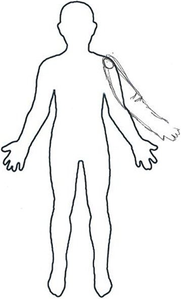

+++
id = "POR-0093"
title = "78-year-old man: a vivid controllable third arm"
account_type = "journal-case"
subject = "78-year-old man"
source_title = "Supernumerary phantom limb in a patient with basal ganglia hemorrhage"
source_url = "https://pmc.ncbi.nlm.nih.gov/articles/PMC5591514/"
source_date = "2017"
accessed = "2026-09-05"
domains = ["body", "agency", "space"]
phenomena = ["supernumerary-phantom-limb", "voluntary-phantom-movement"]
images = ["assets/POR-0093/patient-drawing-supernumerary-arm.jpg"]
+++

# 78-year-old man: a vivid controllable third arm

## Account

Two days after a basal-ganglia hemorrhage he felt an extra arm protruding from the left shoulder beside the paretic arm. It was invisible and untouchable but vivid, persistent, and equal in size and shape to the real limb. He could intentionally wave, grip, and touch objects with the phantom independently, with strength like his unaffected arm. Looking at the real arm or closing his eyes changed nothing.

## Associated image

## Original source

[Supernumerary phantom limb in a patient with basal ganglia hemorrhage](https://pmc.ncbi.nlm.nih.gov/articles/PMC5591514/)
