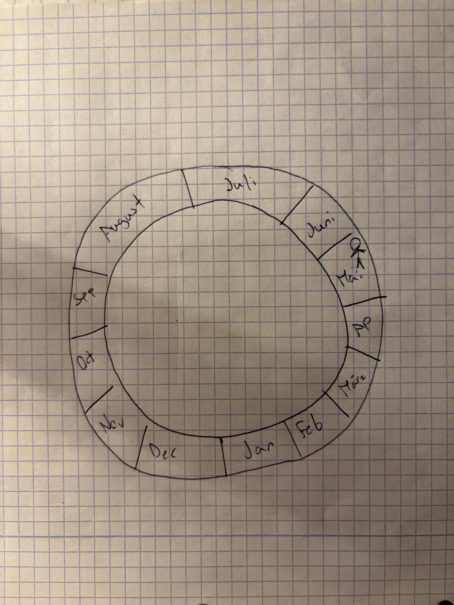

+++
id = "POR-0006"
title = "Standing inside a three-dimensional year whose current month expands"
account_type = "self-report"
subject = "anonymous Reddit poster"
source_title = "is this synesthesia?"
source_url = "https://www.reddit.com/r/Synesthesia/comments/1tsdxo9/is_this_synesthesia/"
source_date = "2026-05-30"
accessed = "2026-09-05"
domains = ["time-space", "spatial-cognition", "visual-imagery", "synesthesia"]
phenomena = ["stable-spatial-form", "perspective-switching", "automatic-concurrent"]
images = ["assets/POR-0006/calendar-drawing.jpeg"]
+++

# Standing inside a three-dimensional year whose current month expands

## Account

The poster experiences the year as a three-dimensional circle and locates themself standing inside it. July and August occupy longer arcs because they correspond to summer break. Independently, whichever month is current becomes as long as July and August.

The attached drawing is an external approximation of the form. The post emphasizes that friends also reported internal calendars but in line-like layouts, making the poster's embodied circular arrangement newly salient as a difference.

## Structure of the experience

- **Geometry:** a circular three-dimensional sequence.
- **Vantage point:** first-person location within the form rather than an outside diagram.
- **Nonuniform scale:** summer months are chronically enlarged.
- **Dynamic scale:** the current month expands to summer-month length.
- **Stability/flexibility:** overall topology is stable while local metric size changes with temporal position.

## Key contrasts

`stable circular ordering` / `state-dependent month size`  
`viewing a calendar` / `occupying a calendar`

## Why this case matters

The earlier survey asked whether months have stable spatial locations. This account shows why that question needs follow-ups about viewpoint, bodily location, dimensionality, nonuniform distance, and whether “stable” permits systematic transformations.

## Source boundaries

The source provides a short description and a hand-drawn representation but no longitudinal consistency test. The accessible page does not expose a durable username.
